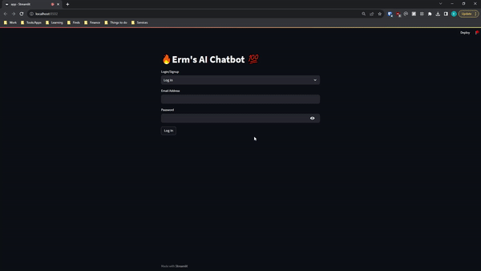
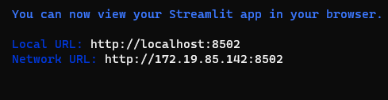

# Erm's AI Chatbot


## Description

An AI Chatbot that works with OpenAI's gpt-3.5-turbo model.




## Description
* Reads and responds user input
* Reads a text file, analyzes name, size, text content, and responds.
* User authentication

## Technologies used:
* Python 3
* [Langchain](https://www.deeplearning.ai/short-courses/langchain-for-llm-application-development/)
* Streamlit
* Firebase
* OpenAI's API


### Dependencies

* Langchain framework 
* Streamlit library
* Firebase_Admin Console 

### Installing

* Fork & Clone this repository
* Activate your Python development environment (source 'Your Project'/bin/activate)
* Install LangChain, Streamlit, & firabase-admin (pip install)
* Create a Firebase project, add your app and set up authentication. [See docs](https://firebase.google.com/docs/auth)
* Create an Open AI API Key. [See docs](https://openai.com/product)

### Executing program

* Download your Firebase .json file and add it to the same directory of 'app.py'
* Add your OpenAI API key to 'apykey.py'
* Run app:
```
streamlit run app.py

```

Your app should open in your browser:


## Help

* For any issues or questions, please [submit a new issue](https://github.com/ThisisErm/Chatbot/issues)

## Contributing
### I am always happy to collaborate. Anyone is able to contribute:

* Fork it (https://github.com/ThisisErm/Chatbot/fork)
* Create your feature branch (git checkout -b feature/fooBar)
* Commit your changes (git commit -am 'Add some fooBar')
* Push to the branch (git push origin feature/fooBar)
* Create a new Pull Request

## Next steps
* A free and open-source LLM such as HuggingFace instead of OpenAI.
* Implementing a conversation history feature.